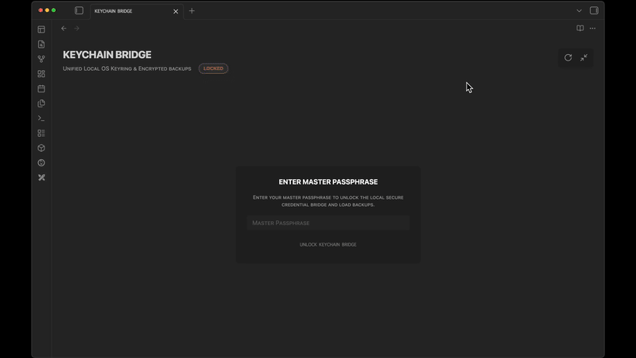

  
  
  <h1 align="center">KEYCHAIN BRIDGE</h1>
  <h3 align="center"> Secure Native Keychain Manager & Encrypted Backup Engine </h3>

  <!-- TOP PURPLE LINKS -->
  
  
  
   
  <!-- BOTTOM GOLD TAXONOMY -->
  
  
  
  

  

    <i> A unified, secure credential bridge and backup suite designed to manage Obsidian native OS-level secrets and deploy client-side encrypted backups. </i>
  

  

Welcome to **Keychain Bridge**. This component unifies secure native OS-level secret management with robust client-side PBKDF2/AES-GCM encrypted snapshot backups, plain-text security leak scanning, and audit logging.

---

## ✨ Features

*   🔑 **OS Keychain Integration**: Read, write, and delete keys stored in your computer's OS keychain via Obsidian's native `SecretStorage` API (DPAPI on Windows, Keychain on macOS).
*   🔐 **Client-Side Cryptography**: Encrypts your offline credential backups using 256-bit AES-GCM, with a key derived from a custom master passphrase using PBKDF2 (100,000 iterations).
*   📦 **Snapshot Recovery**: Create secure offline backups, view backup histories, select specific snapshots, and redeploy or delete records.
*   ⚠️ **Leak Scanner & Migrator**: Discovers plain-text security keys/secrets stored in browser `localStorage` and safely migrates them to native `SecretStorage` with a single click.
*   📜 **Audit Trail**: Logs keychain operations, unlocks, backups, redeployments, and purges to an active vault history log.

---

## 📦 Directory Index & Components

The package exposes the following compiled files:

| File | Description |
| :--- | :--- |
| **[KEYCHAIN BRIDGE.md](KEYCHAIN%20BRIDGE.md)** | Main entry point leaf designed to mount the component in Obsidian. |
| **[src/index.jsx](src/index.jsx)** | Main bootstrap loader and full-tab viewport manager. |
| **[src/App.jsx](src/App.jsx)** | Main React component handling the master keyring interface and crypto operations. |
| **[src/utils/CryptoUtils.js](src/utils/CryptoUtils.js)** | Cryptographic utility routines (PBKDF2, AES-GCM, Base64). |
| **[src/utils/StorageUtils.js](src/utils/StorageUtils.js)** | Native SecretStorage and fallback key management. |
| **[src/styles/ViewStyles.jsx](src/styles/ViewStyles.jsx)** | Glassmorphic, dark theme-aware stylesheet parameters. |
| **[METADATA.md](METADATA.md)** | Packaging manifest outlining indexing, target, and security configurations. |
| **[CONTRIBUTION.md](CONTRIBUTION.md)** | Contributor architecture standards and local compilation guidelines. |
| **[LICENSE.md](LICENSE.md)** | MIT open-source license. |
